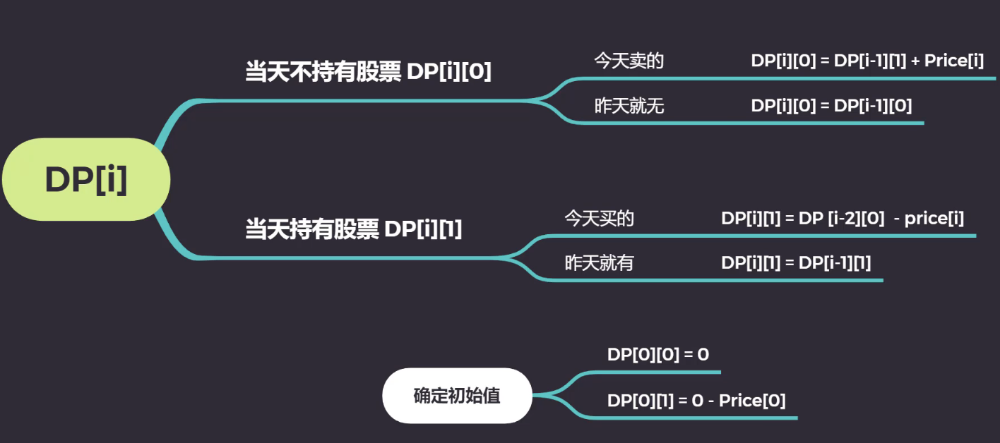

309. ##### [309. Best Time to Buy and Sell Stock with Cooldown](https://leetcode-cn.com/problems/best-time-to-buy-and-sell-stock-with-cooldown)

- 题目描述
  - 给定一段时间内每天的股票价格，已知每次卖出之后必须冷却一天，且每次只能拥有一支股 票，求最大的收益。
- 题解
  - 我们可以使用状态机来解决这类复杂的状态转移问题，通过建立多个状态以及它们的转移方式，能推导出各个状态的转移方程



```java
class Solution {
    public static int maxProfit(int[] prices) {
        int days = prices.length;
        int[][] dp = new int[days][2];
        dp[0][0] = 0;
        dp[0][1] = -prices[0];
        for (int i = 1; i < days; i++) {
            dp[i][0] = Math.max(dp[i - 1][0], dp[i - 1][1] + prices[i]);
            dp[i][1] = Math.max(dp[i - 1][1], (i > 2 ? dp[i - 2][0] : 0) - prices[i]);
        }
        return Math.max(dp[days - 1][0], dp[days - 1][1]);
    }

    public static void main(String[] args) {
        int[] prices = {1, 2, 4};
        System.out.println(maxProfit(prices));
    }
}
```

```java
/*
 * Input: prices = [1,2,3,0,2]
 * Output: 3
 * Explanation: transactions = [buy, sell, cooldown, buy, sell]
 * 思路：
 * s0[i] = max(s0[i - 1], s2[i - 1]); // Stay at s0, or rest from s2
 * s1[i] = max(s1[i - 1], s0[i - 1] - prices[i]); // Stay at s1, or buy from s0
 * s2[i] = s1[i - 1] + prices[i]; // Only one way from s1
 * Then, you just find the maximum of s0[n] and s2[n],
 * since they will be the maximum profit we need
 * (No one can buy stock and left with more profit that sell right :) )
 *
 * Define base case:
 * s0[0] = 0; // At the start, you don't have any stock if you just rest
 * s1[0] = -prices[0]; // After buy, you should have -prices[0] profit. Be positive!
 * s2[0] = INT_MIN; // Lower base case
 */

class Solution {
    public static int maxProfit(int[] prices) {
        int n = prices.length;
        if (n == 0) return 0;
        int[] s0 = new int[n], s1 = new int[n], s2 = new int[n];
        s1[0] = -prices[0];
        s2[0] = Integer.MIN_VALUE;
        for (int i = 1; i < n; i++) {
            s0[i] = Math.max(s0[i - 1], s2[i - 1]);
            s1[i] = Math.max(s1[i - 1], s0[i - 1] - prices[i]);
            s2[i] = s1[i - 1] + prices[i];
        }
        return Math.max(s0[n - 1], s2[n - 1]);
    }

    public static void main(String[] args) {
        int[] prices = {1, 2, 3, 0, 2};
        System.out.println(maxProfit(prices));
    }
}
```