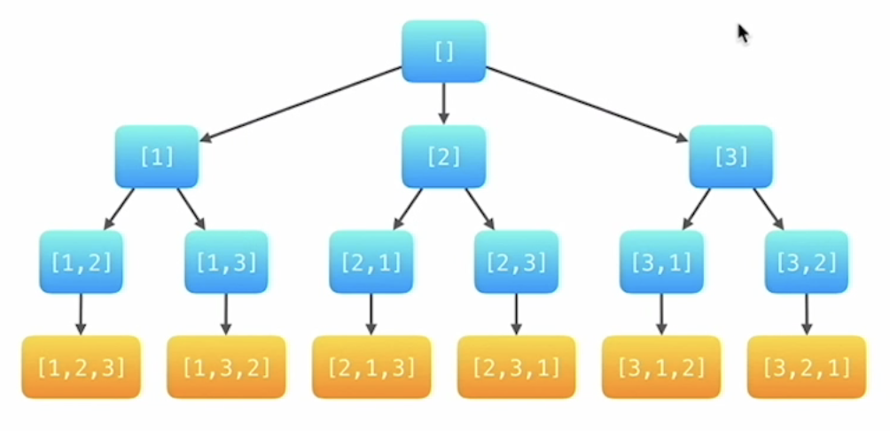

### 全排列问题

- 数组中元素无重复


##### 解题思路

- 深度优先遍历dfs
  - 状态：每一个结点都表示求解问题的不同阶段
  - 深度优先遍历在回到上一层时需要“状态重置”
    - 状态变量
      - 递归到了第几层 depth
      - 已经选择的数 list
      - 布尔数组 used
  - 回溯问题



```java
public class Solution {
    public static List<List<Integer>> permute(int[] nums) {
        List<List<Integer>> res = new ArrayList<>();

        List<Integer> path = new ArrayList<>();
        boolean[] used = new boolean[nums.length];
        dfs(nums, 0, path, used, res);

        return res;
    }

    private static void dfs(int[] nums, int depth, List<Integer> path, boolean[] used, List<List<Integer>> res) {

        if (depth == nums.length){
            res.add(new ArrayList<>(path));
            return;
        }

        for (int i = 0; i < nums.length; i++){
            if (used[i]) continue;
            path.add(nums[i]);
            used[i] = true;
            dfs(nums, depth + 1, path, used, res);
            path.remove(path.size()-1);
            used[i] = false;
        }
        return;
    }
}
```

